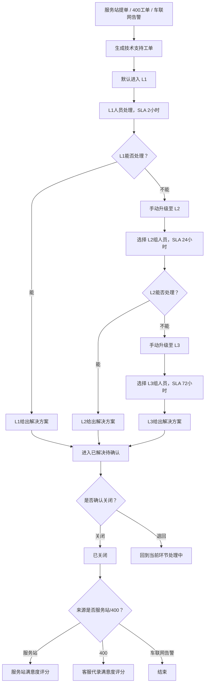

# PRD v0.2.0 - L1 L2 L3 三环处理流程

## 目标

在技术支持工单模块中增加 L1、L2、L3 三环处理机制，使工单能够按照主机厂技术支持组织的分层能力完成升级、处理、解决和关闭。

## 已确认需求

- 技术支持工单增加 L1、L2、L3 三环处理流程。
- L1、L2、L3 对应不同技术支持人员组。
- L1 处理时效为 2 小时。
- L2 处理时效为 24 小时。
- L3 处理时效为 72 小时。
- 技术支持工单默认由 L1 人员处理并给出解决方案。
- L1 无法处理时，手动升级到 L2。
- L2 无法处理时，手动升级到 L3。
- 超过时效不自动升级，只更新 SLA 状态。
- 只有当前处理环节对应的当前处理人可以给出解决方案。
- L1、L2、L3 分派人员时，只能在对应技术支持组里选择。
- 工单详情去掉“回复处理意见”功能。
- 给出解决方案后进入“已解决待确认”。
- 已解决待确认状态保留。
- 已解决待确认状态下，可确认关闭或退回继续处理。
- 已关闭的服务站提单触发服务站满意度评分。
- 已关闭的 400 工单触发客服代录满意度评分。
- 车联网告警关闭后不触发满意度评分。
- 工单列表增加 Tab 筛选：全部、我的待处理、已解决待确认、已关闭、已超时。

## 主流程

## 列表页调整

Tab 筛选：

- 全部
- 我的待处理
- 已解决待确认
- 已关闭
- 已超时

新增字段：

- 当前环节：L1 / L2 / L3
- 当前处理组
- 当前处理人
- 当前环节 SLA
- SLA 状态
- 升级次数
- 满意度状态

## 详情页调整

新增“三环处理信息”分组：

- 当前处理环节
- L1 处理人、开始时间、截止时间、处理结果
- L2 处理人、开始时间、截止时间、处理结果
- L3 处理人、开始时间、截止时间、处理结果

操作调整：

- 删除“回复处理意见”。
- 增加“升级至 L2”。
- 增加“升级至 L3”。
- 保留“给出解决方案”。
- 保留“确认关闭”。
- 保留“退回继续处理”。
- 增加满意度评分入口。

## 验收标准

- 新建或提交工单后默认进入 L1。
- L1 工单 SLA 为 2 小时。
- L1 可手动升级至 L2，升级时只能选择 L2 组人员。
- L2 工单 SLA 为 24 小时。
- L2 可手动升级至 L3，升级时只能选择 L3 组人员。
- L3 工单 SLA 为 72 小时。
- 超时不自动升级。
- 非当前环节处理人不能给出解决方案。
- 给出解决方案后进入已解决待确认。
- 已解决待确认可关闭或退回处理中。
- 服务站来源关闭后进入服务站满意度评分。
- 400 来源关闭后进入客服代录满意度评分。
- 车联网告警来源关闭后不触发评分。
